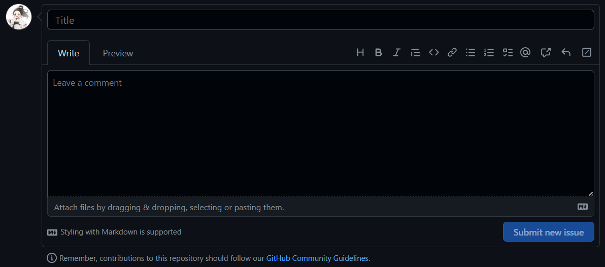

<h1 align="center">Welcome to Míng ài lì's Github repository</h1>

    
    

<!-- ---------------------------------------------------------------------------------------------------- -->

Halo jiljil 😉, selamat datang di github repository pembelajaran pemrograman. Github repository ini dibuat oleh seseorang yang ditujukan untuk dirimu belajar mengenai dunia pemrograman, didalam repository ini terdapat banyak bahasa pemrograman yang bisa dipelajari seperti [HTML], [CSS], [JavaScript], [PHP] dan juga di repository ini menyediakan materi pembelajaran berupa penggunaan [Framework] seperti CodeIgniter.

🤔 Github repository ini juga akan terus menerus dilakukan pembaharuan agar materi yang diberikan semakin akurat dan mudah dipahami. Semangat belajar 🫰🏻

> [!NOTE]
> Jika perlu kamu perlu bantuan dengan dokumentasi ini, silahkan membuat [Issues].

Masukkan title dengan tujuan pembahasan, lalu masukkan deskripsi yang terjadi, bisa juga menerakan file berupa gambar atau file yang ingin dikirimkan pada kolom `Attach files by dragging & dropping, selecting or pasting them`.

<!-- ---------------------------------------------------------------------------------------------------- -->

[HTML]: https://github.com/Mingaili/Mingaili/tree/main/html/
[CSS]: https://github.com/Mingaili/Mingaili/tree/main/css/
[JavaScript]: https://github.com/Mingaili/Mingaili/tree/main/javascript/
[PHP]: https://github.com/Mingaili/Mingaili/tree/main/php/

[Framework]: https://github.com/Mingaili/Mingaili/tree/main/framework

[Issues]: https://github.com/Mingaili/Mingaili/issues/new